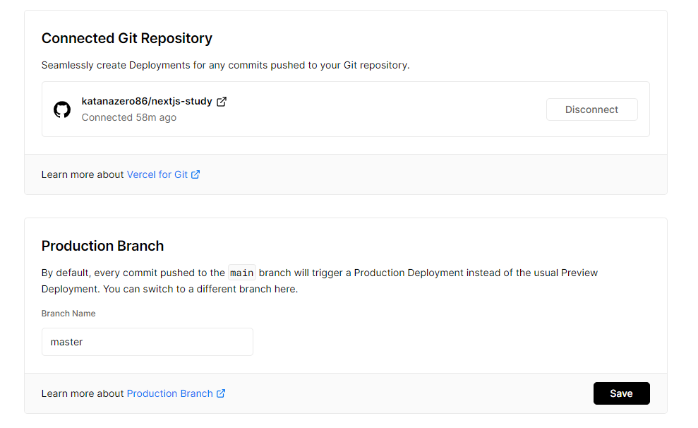
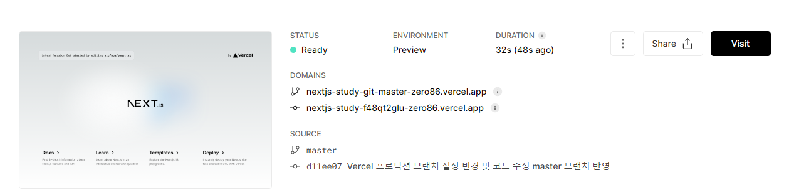
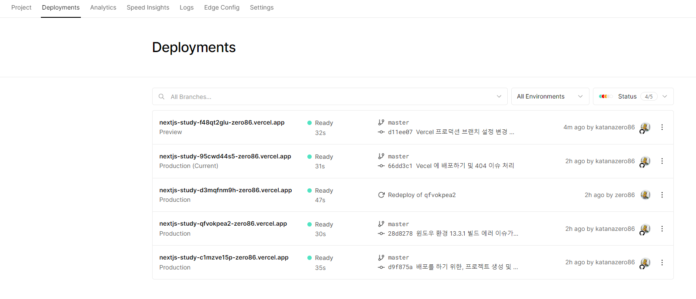
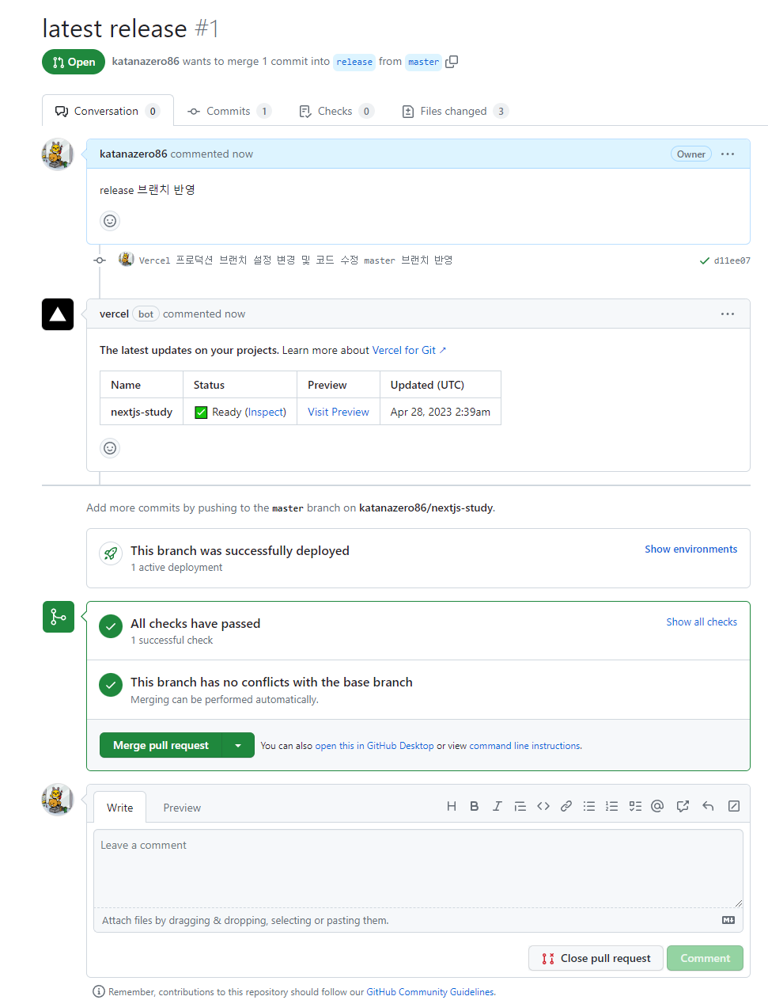
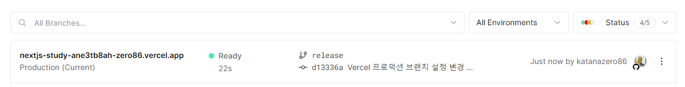

### 배포하기

- vercel에 next.js 앱을 배포를 해보자!

1. 프로젝트 github 에 저장소 생성 후, push

```
git init
git remote add origin <github url>
git push -u origin main
```

2. vercel(https://vercel.com/) 가입 및 로그인
- 개인 프로젝트용이라면, Hobby 선택 / 실제 상용으로 사용하려면, Pro 선택
- github 연동 하면서, 모든 저장소에 Vercel을 설치할건지 선택한 저장소만 선택할건지를 결정


나는 예전에 생성해서 사용하는게 있기때문에, 여기서 따로 저장소를 추가를 해주면 된다.   
next.js 저장소가 보이지 않는다. github에서 설정을 해주면 된다.


Repository access 부분에서 내가 원하는 저장소를 추가해주면 된다.


추가가 된게 확인이 되면, import 를 클릭


보통 root 경로는 기본값을 사용하는데, 이거 같은 경우에는 프로젝트별로 경로가 나뉘어 있어서 선택을함

- Build and Output Settings   
빌드하고 출력할 때, 어떤 명령을 실행할 지 설정이 가능

- Environment Variables   
.env 파일 -> 서버 API Key 및 end point, 다양한 환경변수 등을 관리하는 파일   
해당 파일은 중요한 정보들이기 때문에, 저장소에 올려서 노출시키거나 하는게 아님   
그래서, 보통 배포를 하는 서버에 직접 .env 파일에 대한 정보를 작성하거나 배포를 진행해주는 Cloud 환경에서 설정함


배포가 완료되면, 축하한다고 나오고 Dashboard 에서 확인이 가능   

404 가 발생을 한다 Output 을 확인해보자.


음..? 프로젝트 설정에서 Build & Development Settings 에서 Framework Preset 이 Next.js 로 설정이 되어있지 않다. Next.js 로 설정 후, 재배포 진행


Good!

### CI/CD 사용하기

1. 코드 수정 후, commit & push
2. Vercel 에서 자동으로 감지해서 빌드 시작 및 배포   
-> Vercel 을 사용하면 자동으로 CI/CD 가 구축이 되어짐   
-> CI/CD 파이프라인에 테스트도 없이 바로 commit & push 하자마자 반영이 되면, 매우 무서움(에러가 나는걸 사용자가 본다면 또는 관리자가 본다면..)
3. 실제 현업에서는 개발용 브랜치를 두고, 배포가 되는 브랜치((release, master, main)를 구분
```
// 실습
master 브랜치를 일단 dev 브랜치 개념으로 사용하겠음

git checkout -b release
git push

```
4. Vercel Settings 로 이동 후, 왼쪽에 Git 메뉴 클릭

현재 설정된 프로덕션 브랜치 확인이 가능 일단 현재 실습에서는 release 브랜치를 사용할거므로, 변경   
이제 우리는 개발 시, master 브랜치에서만 하면 됌.   
코드 수정 후, master 브랜치에 반영.



Vercel 에 빌드 및 배포가 이루어지는데, DOMAINS 에 보면 master 브랜치용 URL 과 해당 commit 에 URL 이 만들어진게 확인이 된다.   
그리고 더 이상, 사용자 URL 이 나오지 않는게 확인이 가능하다.


Preview: 미리보기   
Production(Current): 배포한 상태의 변경사항  
Production: 메인 URL 에 반영이 상태   

이제 release 브랜치로 반영을 해보자.   
5. github 에서 PR 생성   
release <- master


Vercel 에서 또 자동으로 무언가를 해준다. Inspect 를 클릭하면, 빌드된 상태와 로그 확인이 가능하며, Visit Preview 를 클릭하면 미리 페이지 확인이 가능하다.




---

- CI(Continuous Integration) = 지속적인 통합   
코드 변경사항을 주기적으로 빈번하게 병합해야 한다.   
병합을 위한 단계(빌드, 테스트, 머지)의 자동화   
-> 개발 생산성 향상 및 코드의 퀄리티 향상

- CD(Continuous Delivery, Continuous Deployment) = 지속적인 제공 또는 지속적인 배포   

CI 는 새로운 코드 변경 사항이 빌드 및 테스트 되어 저장소에 병합이 되는걸 의미   
Continuous Delivery 는 CI 가 완료된(green 을 받은) 준비된 배포 프로젝트를 직접 검증 후, 최종적으로 배포를 하는데 이는 수동으로 이루어짐 이러한 단계를 지속적인 제공이라고함   
Continuous Deployment 는 위 내용과 같은데, 수동이 아닌 자동으로 처리   
-> CD 는 최종 배포단계가 자동인지 수동인지에 차이가 있음   

정리: CI 가 새로운 소스코드의 빌드, 테스트 후에 저장소에 병합되는걸 의미하고, CD 는 배포가 준비된 제품을 자동 또는 수동으로 릴리즈 되는 것을 의미
결론적으로, 빠르게 제품을 테스트 및 출시하고자 나온 프로세스가 CI/CD 임

---
