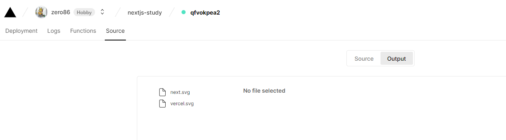

### 배포하기

- vercel에 next.js 앱을 배포를 해보자!

1. 프로젝트 github 에 저장소 생성 후, push

```
git init
git remote add origin <github url>
git push -u origin main
```

2. vercel(https://vercel.com/) 가입 및 로그인
- 개인 프로젝트용이라면, Hobby 선택 / 실제 상용으로 사용하려면, Pro 선택
- github 연동 하면서, 모든 저장소에 Vercel을 설치할건지 선택한 저장소만 선택할건지를 결정


나는 예전에 생성해서 사용하는게 있기때문에, 여기서 따로 저장소를 추가를 해주면 된다.   
next.js 저장소가 보이지 않는다. github에서 설정을 해주면 된다.


Repository access 부분에서 내가 원하는 저장소를 추가해주면 된다.


추가가 된게 확인이 되면, import 를 클릭


보통 root 경로는 기본값을 사용하는데, 이거 같은 경우에는 프로젝트별로 경로가 나뉘어 있어서 선택을함

- Build and Output Settings   
빌드하고 출력할 때, 어떤 명령을 실행할 지 설정이 가능

- Environment Variables   
.env 파일 -> 서버 API Key 및 end point, 다양한 환경변수 등을 관리하는 파일   
해당 파일은 중요한 정보들이기 때문에, 저장소에 올려서 노출시키거나 하는게 아님   
그래서, 보통 배포를 하는 서버에 직접 .env 파일에 대한 정보를 작성하거나 배포를 진행해주는 Cloud 환경에서 설정함


배포가 완료되면, 축하한다고 나오고 Dashboard 에서 확인이 가능   

404 가 발생을 한다 Output 을 확인해보자.



음..? 프로젝트 설정에서 Build & Development Settings 에서 Framework Preset 이 Next.js 로 설정이 되어있지 않다. Next.js 로 설정 후, 재배포 진행


Good!