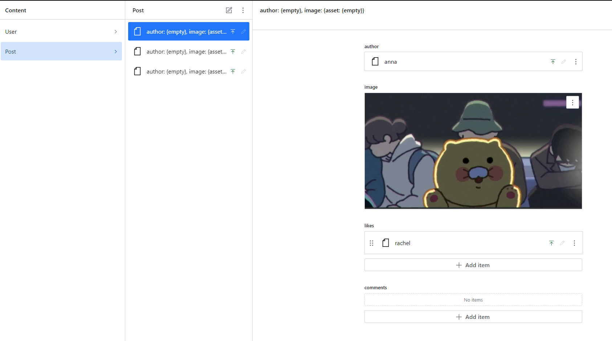

# my-instagram

---

- 개발환경
```
OS: window
node: v16.16.0
npm: v8.11.0

next.js: v13.4.1
react.js: v18.2.0
typescript: v5.0.4
tailwindcss: v3.3.2
daisyui: v2.51.6
```

- 기능
```
1. 로그인, 로그아웃(로그인은 social login: google)
2. 로그인 된 사용자는 index 페이지로 이동
3. 로그인한 사용자의 follwing 사용자 / 로그인한 사용자의 소개 및 링크
4. card 형태 UI 로 게시글이 나열되어있음
5. card ui 에는 사용자의 아바타, 사용자의 ID, 사진, 좋아요, 즐겨찾기, 작성시간(상대적인 시간), 내용 및 댓글이 있음
6. 사진 및 View all comments 를 클릭하면 상세로 이동
7. 검색 페이지, 마이 페이지 등이 존재함
```

---

- 작업
```
2023.05.08
- react-icons 패키지 추가
- Header 컴포넌트 작성
- FollowingSection, FollowingUserAvatar 컴포넌트 작성

2023.05.09
- like 및 bookmark 아이콘 컴포넌트 작성 및 스타일링
- Card 컴포넌트 작성 및 스타일링
- sanity 가입 및 sanity 경로에 sanity-studio 프로젝트 생성
- 강의 참조하여 User, Post 스키마 정의 및 sanity-studio 를 사용하여 더미 데이터 생성
데이터를 추가했으나, 가독성이 떨어짐 -> sanity-studio 도 웹앱이므로 개선이 가능

2023.05.11
- Next Auth 부분 추가 및 간단하게 테스트
- 로그인 페이지 작성 및 스타일링
- layout 을 구분해서 사용하고자, Routes Groups 를 사용하여 root layout 분리

```


sanity-studio 에서 저걸 하나하나 클릭해야, 누가 작성했고 이미지는 뭔지 확인이 가능   
List Previews 이용하여 개선이 가능

참조: https://www.sanity.io/docs/previews-list-views