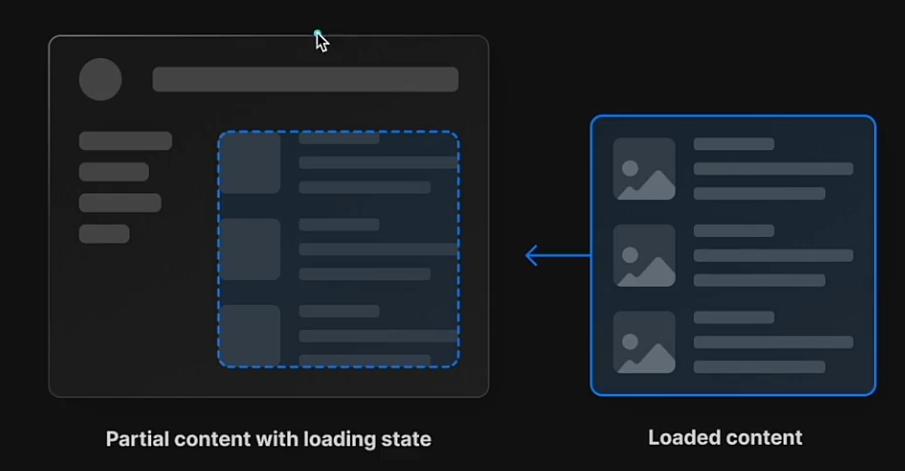
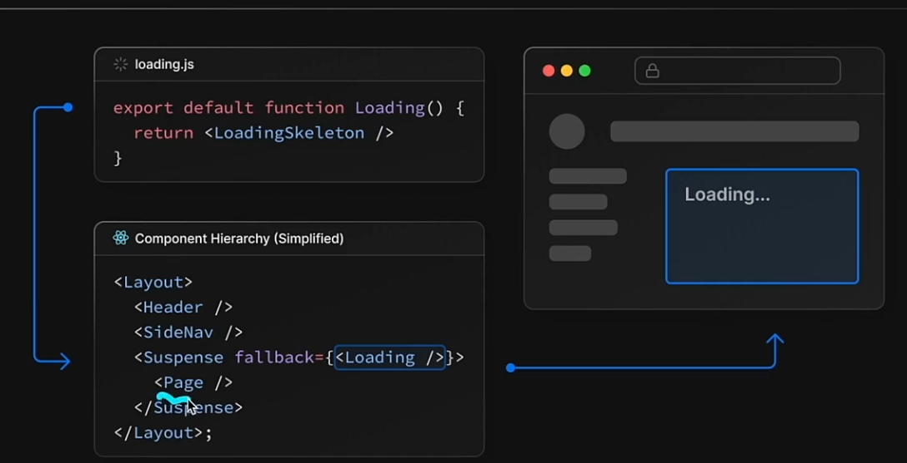
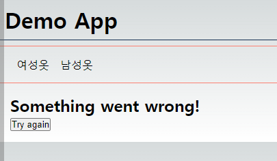

# 성능개선

---

### loading UI

- next.js v13 에 추가된 app 폴더는 파일 기반으로 라우트를 구성함(사실상 폴더 단위로 구성)
- page, layout, template, loading, error, not-found 을 구성이 가능

loading 은 해당 라우트에서 page UI 가 준비되기 이전에 사용자에게 무언가 준비중 이다라는걸 표시해줌   
loading 을 사용하는 것은 React Suspense Boundary 를 사용하는 것과 동일


```
/products
```
네트워크탭에서 Slow 3g 로 확인이 가능

레이아웃까지는 출력이 되고, 레이아웃에 children 을 Suspense 로 감싸줌 -> page.jsx 또는 page.tsx 가 Suspense 에 감싸여 진다고 생각하면 됌

개발 환경은 SSR 처럼 동작을 하는데, SSG 인 경우에는 loading 이 동작할까?

```
Route (app)                                Size     First Load JS
┌ ○ /                                      5.12 kB        79.3 kB
├ ○ /api/hello                             0 B                0 B
├ ○ /favicon.ico                           0 B                0 B
├ ○ /products                              856 B          80.5 kB
└ ● /products/[slug]                       355 B          74.5 kB
    ├ /products/1234
    ├ /products/1235
    └ /products/1236
+ First Load JS shared by all              74.1 kB
  ├ chunks/2443530c-ed2463c0dcb7ea9f.js    50.2 kB
  ├ chunks/961-50d8b30c30c8ea0e.js         22 kB
  ├ chunks/main-app-5725061bef0c45d2.js    212 B
  └ chunks/webpack-252e595c2d3b6761.js     1.72 kB

Route (pages)                              Size     First Load JS
─ ○ /404                                   178 B          86.1 kB
+ First Load JS shared by all              85.9 kB
  ├ chunks/main-837be341af35e928.js        84 kB
  ├ chunks/pages/_app-c544d6df833bfd4a.js  192 B
  └ chunks/webpack-252e595c2d3b6761.js     1.72 kB

○  (Static)  automatically rendered as static HTML (uses no initial props)
●  (SSG)     automatically generated as static HTML + JSON (uses getStaticProps)
```


products 컴포넌트가 SSG 로 만들어진게 확인이 되며, 이를 실행해보니 처음에 받은 HTML 에 "로딩중 입니다..." 는 보이지 않는다.

-> 로딩은 동적으로 SSR 을 할 때 빠르게 내용을 보여주고 이후에 실제 내용을 표현하게 해주며, SSG 같은 경우에는 사실 로딩이라는건 큰 의미가 없다.

### loading UI 자세한 동작 과정

- React Suspense 를 사용

- 경로내에 loading.jsx 또는 loading.tsx 를 만들기만 하면 됌


한계는 loading 파일을 사용하면 해당 경로내에 한번만 사용이 가능 = 중첩된 Suspense 사용이 불가능 -> 이를 위해서는 경로내에 하나의 page 컴포넌트에 내용을 작은단위로 분리해야함   
병렬적으로 data fetching 이 이루어지는 상황에서 loading 을 사용하고 싶다면, 직접 Suspense 로 감싸서 사용이 가능

### error UI

- error 는 React Error Boundary 를 사용
- 경로내에 error.jsx 또는 error.tsx 를 작성하면 가능 -> error 컴포넌트는 무조건 클라이언트 컴포넌트

my-performance-improvement/src/app/products/page.tsx 코드 내에, `throw new Error();` 코드를 추가 후, error.tsx 를 작성하였음



에러가 발생하는게 확인이 가능하며, error.tsx 컴포넌트에 작성한 UI가 출력되는 부분도 확인   
화면 왼쪽 하단에 UI가 하나 출력이 되는데 이것은 개발모드에서만 출력이 됌   

ErrorBoundary 로 수동적으로도 사용이 가능   
경로내에 error.jsx 또는 error.tsx 가 없고 상위경로에 있다면 그걸 출력해줌 -> 에러 버블링