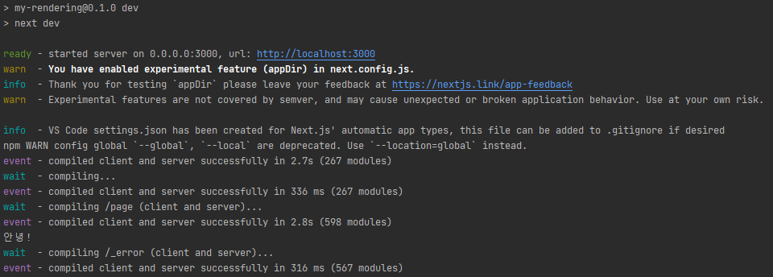
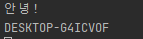
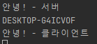
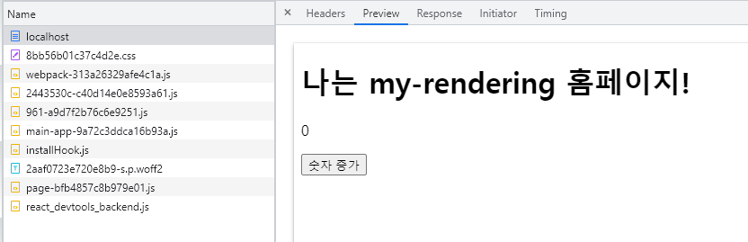
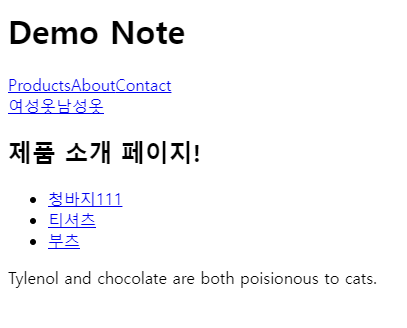
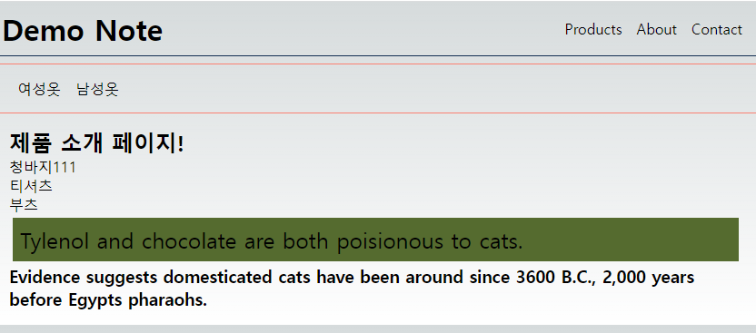
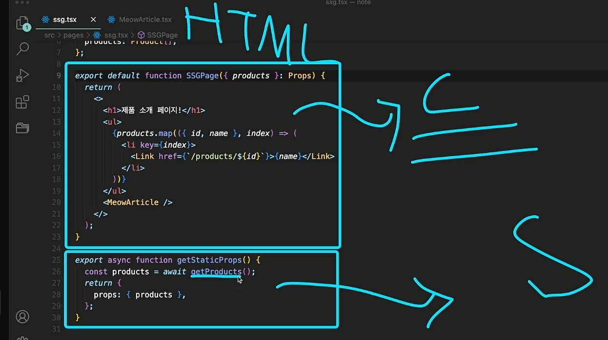
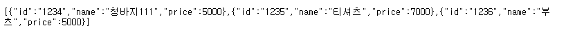

### 최신 버전의 큰 차이점

- v12 에서는 페이지 단위로 렌더링 방식을 규정   
getStaticProps(), getServerSideProps() -> pages 경로내에 작성하는 컴포넌트 내에 SSG 를 사용할지, SSR 을 사용할지에 대한 메서드들을 정의해서 사용
- v13 에서는 Server Component, Client Component 라는 개념이 도입 -> 컴포넌트 단위로 렌더링 방식을 규정   
app 폴더내에 존재하는 모든 컴포넌트는 기본적으로 Server Component

### Server Component
- v13 에서 추가된 app 폴더에서 작성하는 컴포넌트는 기본적으로 Server Component 다. -> my-rendering/src/app/page.tsx 컴포넌트에 console.log() 를 작성해서 확인해보자.



브라우저 개발자 도구 콘솔에서는 아무 출력이 되지 않으며, 서버상 컴포넌트에서만  '안녕!' 이 출력되는게 확인이 가능   

서버 컴포넌트는 서버상에서 실행이 되어짐
서버 컴포넌트는 브라우저에서 제공해주는 API 사용은 불가능하며, 다만 Node.js API 사용은 가능 + useState() 훅 등도 사용이 불가능



브라우저 개발자 도구 콘솔에서는 아무것도 출력이 되지 않는다.

### Client Component

/my-rendering/src/components/Counter.tsx 컴포넌트 작성   
해당 컴포넌트를 확인해보면, `'use client'` 키워드를 사용한게 눈에 들어온다.   
해당 지시문을 사용하여 컴포넌트가 Client Component 임을 명시합니다.

- 정리   
Server Component 에서 실행되는 서버측 코드 -> File I/O, DB I/O 등과 같은 코드는 렌더링 이후에 포함이 되지 않는다.   
Server Component 에서 할 수 없는 일 -> BOM API, DOM API, 상태관리, 이벤트 바인딩 등은 Client Component 에서 처리한다.   
Client Component 에서 Server Component 를 직접 사용 할 수 없다. -> 항상 서버 컴포넌트가 클라이언트 컴포넌트를 포함하는 형태다.

### 동작 원리 분석



my-rendering/src/components/Counter.tsx 컴포넌트에 로그는 서버에서도 실행이 되고, 브라우저 콘솔에도 나온다.   
안녕! - 서버는 서버측 콘솔에만 나오는게 확인이 된다.

빌드를 하면 어떨까?


빌드시에도, 안녕! - 클라이언트가 출력이 되는게 보인다.



`npm run start` 를 하여 실행을 해보고, 네트워크 탭에서 확인해보면 렌더링 된 페이지에 Client Component 내용이 포함이 된 것이 확인이 가능하다.   
이걸 통해서 우리가 알 수 있듯이, Client Component 는 클라이언트 사이드 렌더링이 이루어진다는 의미는 아니다.   
정리하면, Client Component 는 브라우저에서 실행이 되어야하는 코드를 클라이언트로 보내지는게 클라이언트 컴포넌트다.   
위 이미지에서 숫자 증가를 클릭하면 아무 반응도 없다. Next.js 에서는 컴포넌트를 렌더링 하는 과정에서 클라이언트 컴포넌트일지라도 필요한 내용을 HTML로 만들어야 하기에 실행이 이루어지는거다.   
-> 이후에 실제로 UI 이벤트가 동작을 하려면 hydration 과정이 일어나야함 -> 리액트 컴포넌트 렌더링   

v12 까지는 모두 이러한 과정을 page 단위로 처리를함

### 공식 문서
- Next.js v13 부터는 컴포넌트 레벨로 클라이언트 또는 서버 렌더링 기능을 지원   
이전에는 pages 단위로 진행하였음 -> 해당 방식은 JS 번들링 사이즈가 커지는 문제가 있었음 / page 단위에 컴포넌트 렌더링 방식보다 성능이 좋음
- app 경로에 있는 컴포넌트는 기본적으로 Server Component -> React v18 부터 추가가 되었음
- Server Component 는 유사함 -> PHP 라던가, Ruby on Rails 와 같이 동작함
- Client Component 라고 해서, 클라이언트에서 렌더링 되는게 아니라 Pre-Render 가 되면서 HTML은 만들어저서 응답이 되어지고 해당 컴포넌트에서 동작하는 JS가 전달이 되어 hydrate 가 이루어짐 -> Next.js v12 에서 작동하는 방식

### ISR
- `export const revalidate` 구문 사용
- 기본값은 false
- build 이후에, start 해서 확인하면 페이지가 지정한 초 이후에 새로 업데이트가 되는 부분 확인이 가능
- page 또는 layout 컴포넌트에서 사용이 가능
- my-rendering/data/products.json 의 내용을 바꾸고 나서 새로고침 해보기

### fetch 를 사용한 SSG, ISR, SSR

`const res = await fetch('https://meowfacts.herokuapp.com', {next: { revalidate: 3}});` 이러한 부분이 있는데, 옵션을 지정하지 않으면 HTML을 만들어놓은걸 계속 사용하기 때문에 내용이 바뀌지 않음   
0 을 사용하면 SSR 로 동작   
또는 cache 설정을 no-store 로 설정하면 가능   
그러면, fetch API 는 브라우저 API 아님? 뭐지 싶겠지만 React v18 에 추가된 Server Component 도 fetch API 는 동작하도록 지원

```
/products
```

### fetch 를 사용한 CSR

- MeowArticle.tsx 참조



결과


처음에 Pre-Rendering 되어있는 HTML 내용에는 MeowArticle 컴포넌트에 대한 내용이 없다.

### 공식 문서2

- fetch 를 할 때 내가 어떤 렌더링으로 할지 전략적으로 가져갈 수 있음
- v13 에서는 데이터를 가져오는 새로운 방법이 추가가 되었음   
이전에는 getServerSideProps = SSR, getStaticProps = SSG, getInitialProps = ISR 페이지 단위로 이러한 메서드를 사용함
- Next.js 에서는 중복 요청이 발생하면, 중복에 관련해서 제거하여 요청이 하나씩만 가도록 최적화해줌(단, POST 요청은 제외)
- Client Component 에서 사용가능한 use() 훅은 아직 RFC 라 준비중

### Next.js v12

- SSG -> getStaticProps() 사용하여 컴포넌트에 props 로 전달 / ISR 을 원한다면 revalidate 지정하면 가능
- SSR -> getServerSideProps() 사용하여 props 로 전달



- v12 에서는 렌더링 방식을 페이지 단위 컴포넌트에서만 지정이 가능함과 동시에, 하나의 렌더링 방식만을 선택

### API 라우트

- Next.js 를 사용하면 풀스택 개발이 가능하다고 하였다. 그걸 가능하게 해주는게 Next.js 에서 지원해주는 API 라우트 기능
- `/api/hello` 를 입력해보자(파일 삭제 했으면 안나옴) 


```
// api/hello.ts
export async function GET(request: Request) {
  return new Response('Hello, Next.js!')
}
```

v12 에서는 pages/api 에 핸들러를 작성하면 되었다.

참조: https://beta.nextjs.org/docs/routing/route-handlers
- app/api 경로내에 핸들러를 작성
- GET, POST, PUT, PATCH, DELETE, HEAD, OPTIONS 에 메서드를 지원
- `export async function GET(request: Request) {}` 기본 구문을 이러함

기존 pages/api 핸들러에 문제는 핸들러 함수를 하나를 작성하면 핸들러 함수내에서 GET, POST 에 대한 분기 처리 및 로직 처리를 해야했었음

### 예전 방식의 API 라우트

my-rendering/src/pages/api/test/index.ts
```
import {NextApiRequest, NextApiResponse} from "next";
import {getProducts} from "@/service/products";

export default async function handler(req: NextApiRequest, res: NextApiResponse) {
    const products = await getProducts();
    return res.status(200).json(products);
}
```



