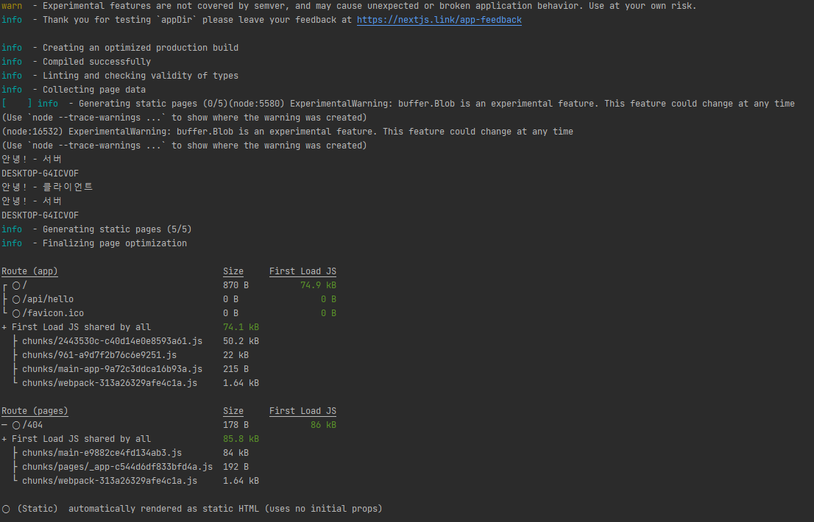

### 최신 버전의 큰 차이점

- v12 에서는 페이지 단위로 렌더링 방식을 규정   
getStaticProps(), getServerSideProps() -> pages 경로내에 작성하는 컴포넌트 내에 SSG 를 사용할지, SSR 을 사용할지에 대한 메서드들을 정의해서 사용
- v13 에서는 Server Component, Client Component 라는 개념이 도입 -> 컴포넌트 단위로 렌더링 방식을 규정   
app 폴더내에 존재하는 모든 컴포넌트는 기본적으로 Server Component

### Server Component
- v13 에서 추가된 app 폴더에서 작성하는 컴포넌트는 기본적으로 Server Component 다. -> my-rendering/src/app/page.tsx 컴포넌트에 console.log() 를 작성해서 확인해보자.

브라우저 개발자 도구 콘솔에서는 아무 출력이 되지 않으며, 서버상 컴포넌트에서만  '안녕!' 이 출력되는게 확인이 가능   

서버 컴포넌트는 서버상에서 실행이 되어짐
서버 컴포넌트는 브라우저에서 제공해주는 API 사용은 불가능하며, 다만 Node.js API 사용은 가능 + useState() 훅 등도 사용이 불가능

브라우저 개발자 도구 콘솔에서는 아무것도 출력이 되지 않는다.

### Client Component

/my-rendering/src/components/Counter.tsx 컴포넌트 작성   
해당 컴포넌트를 확인해보면, `'use client'` 키워드를 사용한게 눈에 들어온다.   
해당 지시문을 사용하여 컴포넌트가 Client Component 임을 명시합니다.

- 정리   
Server Component 에서 실행되는 서버측 코드 -> File I/O, DB I/O 등과 같은 코드는 렌더링 이후에 포함이 되지 않는다.   
Server Component 에서 할 수 없는 일 -> BOM API, DOM API, 상태관리, 이벤트 바인딩 등은 Client Component 에서 처리한다.   
Client Component 에서 Server Component 를 직접 사용 할 수 없다. -> 항상 서버 컴포넌트가 클라이언트 컴포넌트를 포함하는 형태다.

### 동작 원리 분석

my-rendering/src/components/Counter.tsx 컴포넌트에 로그는 서버에서도 실행이 되고, 브라우저 콘솔에도 나온다.   
안녕! - 서버는 서버측 콘솔에만 나오는게 확인이 된다.

빌드를 하면 어떨까?

빌드시에도, 안녕! - 클라이언트가 출력이 되는게 보인다.

`npm run start` 를 하여 실행을 해보고, 네트워크 탭에서 확인해보면 렌더링 된 페이지에 Client Component 내용이 포함이 된 것이 확인이 가능하다.   
이걸 통해서 우리가 알 수 있듯이, Client Component 는 클라이언트 사이드 렌더링이 이루어진다는 의미는 아니다.   
정리하면, Client Component 는 브라우저에서 실행이 되어야하는 코드를 클라이언트로 보내지는게 클라이언트 컴포넌트다.   
위 이미지에서 숫자 증가를 클릭하면 아무 반응도 없다. Next.js 에서는 컴포넌트를 렌더링 하는 과정에서 클라이언트 컴포넌트일지라도 필요한 내용을 HTML로 만들어야 하기에 실행이 이루어지는거다.   
-> 이후에 실제로 UI 이벤트가 동작을 하려면 hydration 과정이 일어나야함 -> 리액트 컴포넌트 렌더링   

v12 까지는 모두 이러한 과정을 page 단위로 처리를함